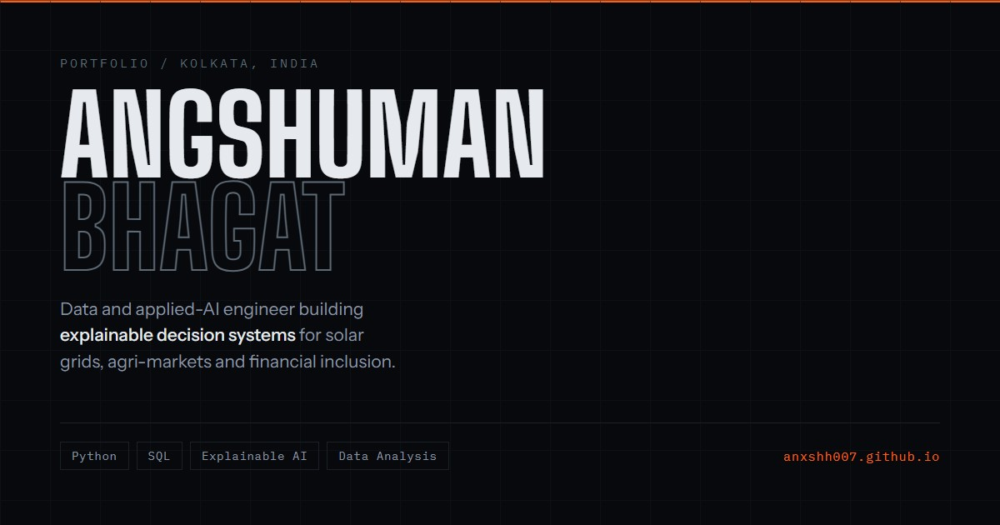

# anxshh007.github.io

**Live → <https://anxshh007.github.io>**

The personal portfolio of **Angshuman Bhagat** — data and applied-AI engineer,
Kolkata. B.Tech Computer Science & Engineering (Data Science), Techno India
University.



---

## What's here

| Page | Contents |
| --- | --- |
| [`index.html`](index.html) | The portfolio — profile, selected work, team leadership, experience, stack, credentials, contact |
| [`projects.html`](projects.html) | Long-form case files for six public projects: what each does, how it works underneath, and where its limits are |
| [`blogs.html`](blogs.html) | The blog — study material, starting with Stanford CS229 |
| [`blogs/`](blogs) | The study guides themselves, one self-contained page per lecture |
| [`404.html`](404.html) | Styled not-found page |
| [`assets/`](assets) | Nine project screenshots and the social preview card |

## How it is built

No framework, no build step, no dependencies, no package manager. Two HTML
files with their CSS and JavaScript inline. Clone it and open `index.html` —
that is the whole setup.

**Motion.** One `requestAnimationFrame` loop reading `getBoundingClientRect()`
drives everything: sections dolly toward the camera as they arrive, per-item
lift inside each one, a sliding rail indicator and a scroll readout. The hero
holds completely sharp until 85% of it has scrolled past. Transforms and
`will-change` are attached only while an element is actually moving and removed
once it settles, so text never renders on a promoted compositing layer while it
is being read.

**Language chart.** The bars ship with real byte counts measured from the GitHub
API. On load the page re-fetches them live and repaints; if the request fails or
is rate-limited the measured values stay, so the chart never blanks.

**Logos.** Twenty-one brand marks as an inline SVG sprite — nothing is fetched
from a CDN, so the stack section renders offline. Paths from
[simple-icons](https://simple-icons.org) (CC0), recoloured to stay legible on a
near-black ground.

**Screenshots.** All genuine. Four of the six projects ship as single
self-contained HTML files, so those were captured by rendering the published
builds themselves rather than mocking anything up.

**Study guides.** Each page under `blogs/` is one file with everything in it —
the mathematics typeset in the document, the figures and interactive demos drawn
on a canvas by the page itself, the fonts embedded. That is why they are large,
and why they work with the network off.

## Accessibility and resilience

- Every section rests at `scale(1) / opacity(1)` in CSS, so the page reads top
  to bottom with JavaScript disabled.
- The entire motion layer is disabled under `prefers-reduced-motion`.
- Visible keyboard focus states throughout; images carry descriptive `alt` text.
- Wide content scrolls inside its own container — the page body never scrolls
  sideways.

## Type

[Big Shoulders Display](https://fonts.google.com/specimen/Big+Shoulders+Display)
for display, [Instrument Sans](https://fonts.google.com/specimen/Instrument+Sans)
for body, [IBM Plex Mono](https://fonts.google.com/specimen/IBM+Plex+Mono) for
labels and data.

## Running it locally

```bash
git clone https://github.com/anxshh007/anxshh007.github.io.git
cd anxshh007.github.io
```

Open `index.html` in a browser. Nothing to install.

## Reuse

The code is here to read and learn from. The written content, screenshots and
personal details are mine — please don't republish them as your own.

## Elsewhere

- GitHub — [@anxshh007](https://github.com/anxshh007)
- LinkedIn — [angshuman-bhagat-profilevisit](https://www.linkedin.com/in/angshuman-bhagat-profilevisit/)
- Email — angshumanbhagat414@gmail.com
